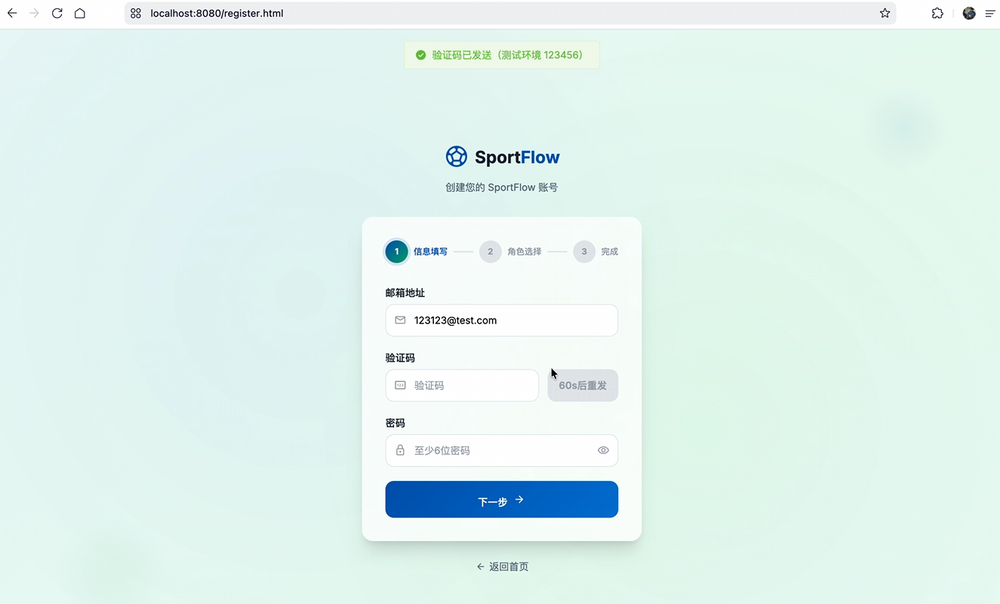
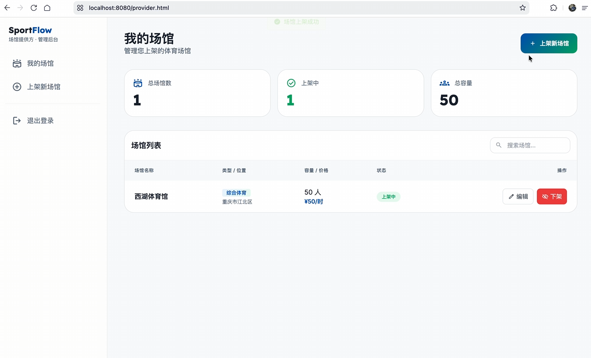
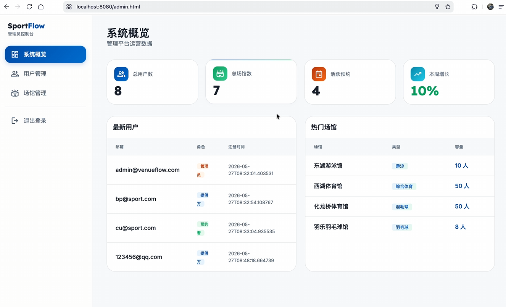
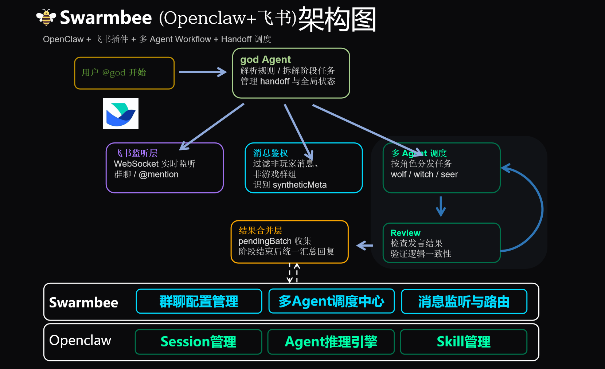

# Swarmbee - Multi-Agent Collaboration Plugin 
> 基于 OpenClaw 的多智能体协作引擎，在飞书群为你带来“超级打工人团队”。

# ✨ 这是什么？

Swarmbee 是一个轻量化的飞书多智能体插件。只需将机器人拉入群聊，多个 AI 角色（产品经理、工程师、分析师……）便会自动组队，在群内**自主推进**工作阶段、**自主协商**分歧、**自主完成**交付物——从调研、开发到分析报告，全程无需你一步步指挥。  
Important: 它把「和 AI 聊天」变成了能落地交互的「超级打工人团队」。

### 🆚 与 Claude Code / WorkBuddy 的区别

|  | Claude Code | WorkBuddy | **Swarmbee** |
|---|-------------|-----------|---------------|
| **协作模式** | 你与单个 AI 结对编程 | 你指挥多个 AI 分工 | 多个 AI 在群里自主协商、推进、工作，你只需给出目标 |
| **可见性** | 仅在终端或 IDE 内交互 | 通常仅对发起者可见 | 群聊全员可见，过程透明，完美适配个人和团队的各种场景 |
| **人工干预** | 每一步都需你确认和引导 | 需要你描述分工逻辑 | 零干预，AI 自行拆解任务、管理进度 |
| **适用场景** | 单仓库编码 | 小规模多任务分解 | 跨角色复杂项目、多人协同场景（调研、谈判、设计到交付） |

> Claude Code 是你和 AI 一起写代码的极佳助手；WorkBuddy 帮你把任务分给不同 AI。  
> **而 Swarmbee 更进一步——你只需要说出想要什么，一群角色会自动把事办好，并把过程和结果晒在群里。**

# 🎬 视频演示

| 狼人杀 🐺 | 健身助手 💪 | 场馆预约 🏟️ |
|:---:|:---:|:---:|
| <br>[🎬 高清视频](videos/狼人杀30秒gif.mp4) | <br>[🎬 高清视频](videos/健身助手30秒gif.mp4) | <br>[🎬 高清视频](videos/场馆预约30秒gif.mp4) |

> 💡 GIF 自动循环播放预览；点击"高清视频"可查看完整 mp4。


# 🌲 Examples 案例代码

Swarmbee全流程自主生成的web应用开发案例代码位于 `examples/` 目录，每个子文件夹对应一个完整的团队配置示例：

- [`examples/book-rent/`](examples/book-rent/) — 图书借阅系统代码
- [`examples/sports-booking/`](examples/sports-booking/) — 体育场馆预约系统代码


**体育场馆预约系统界面预览**：

| 运动场馆首页 | 注册页 | 场馆管理页 | 管理员页 |
| :--: | :--: | :--: | :--: |
|  |  |  |  |

# 🖥️ 架构图
| 

---

# 💡 核心理念：群体智能涌现 —— AI 协作“三大自主”

- **自主推进**：Agent 根据目标自动拆解阶段，无需用户一步步下指令。
- **自主协商**：不同角色（如 PM 与 Coder）在群聊中自动对齐需求，解决冲突。
- **自主完成**：最终交付可运行的产物，如代码包、分析报告或数据清单。


# 🧩 特性

- 🧠 **人格注入系统**：一行命令为 AI 注入“xxx.SKILL”或你自己调校的人设。
- 👥 **多场景覆盖**：任意角色组队，可在飞书群完成调研、决策、谈判、头脑风暴。
- 🔌 **一行接入飞书**：零侵入现有工作群，机器人即拉即用，原有工作零打扰。
- 📦 **开箱即用的团队包**：一键部署预置团队，立刻体验多智能体协作。


# 🧳 预置团队

| 团队名 | 能力 | 部署命令 |
|--------|------|----------|
| 📚 代码开发协作组 | 生成完整的web应用（前后端） | `./install.sh book-rent` |
| 🏟️ 健身助手组 | 日常健身助手 | `./install.sh sports-booking` |
| 🐺 狼人杀推理组 | 多角色发言、投票、复盘 | `./install.sh wolf-game` |
| 🧮 数据分析组 | 数据建模、分析、报告生成 | 即将开放 |

> 更多团队可通过 [幻境工坊](https://www.itswarmbee.com) 下载或自行编写配置文件扩展。

# 🚀 Swarmbee-插件下载并安装

一行命令完成安装与配置：

```bash
curl -fsSL https://github.com/krisshaw123/Swarmbee/raw/main/swarmbee.sh | bash
```

脚本会自动检测环境，缺少 openclaw / openclaw-lark 时会询问是否自动安装。

## 第二步：在飞书开放平台创建 Agent 并绑定

1. 前往 [飞书开放平台](https://open.feishu.cn/) 创建相应的Agent应用，获取 App ID 和 App Secret
2. 在 OpenClaw 中完成飞书渠道绑定（使用飞书开放平台创建的 App ID 和 App Secret）

## 第三步：重启 OpenClaw

```bash
openclaw gateway restart
```
---

# 🚀 Swarmbee-「超级打工人团队」一键配置

如果你已经按照 [Install](#install) 完成了基础环境部署，想立刻拉起一个示例团队开始协作，只需两步：
### 1. 下载团队配置包运行安装脚本install.sh

- 访问 [幻境工坊](https://www.itswarmbee.com) 注册/登录,邀请码在下面👇
- 下载你需要的 Team 压缩包（如 `book-rent-team.zip`）

***Caution: 也可下载完整install之后，自行配置AGENT团队！

### 2. 本机一键配置

```bash
# 解压团队配置包
unzip book-rent-team.zip -d my-team
cd my-team

# 赋予执行权限并运行一键部署脚本
chmod +x install.sh
./install.sh
```

## 🎬 视频教程
- 📹 [高清视频演示](videos/AgentTeam_Setting_Example.mp4) – 手把手带你完成团队部署
- 📺 [B站演示地址](https://www.bilibili.com/video/BV1Ts7G64Enx/)
- 📄 [文字版步骤](#quick-start) 见上文 Quick Start

### 3. 可用邀请码(不定期更新)
cvadsfg!xa,grnrsd_@12*,adfdanhnh,cvadv4589!,fdghd**13_

---
# 🤝 参与贡献

- 欢迎 Star ⭐ 和 Fork 本仓库
- 加入微信群与其他开发者交流
- 通过 Issue 提交想法或 Bug
- 分享你创建的新团队配置文件，让更多人受益

**让 AI 为你组队，而不是你为 AI 打工。**  
下载、部署、拉群，开启你的第一个多智能体协作体验！

# 👥 Contributors

| Role | GitHub |
|:---|:---|
| Lead/Architect | [@krisshaw123](https://github.com/krisshaw123) |
| CoreBackendDev | [@dingcheng-126](https://github.com/dingcheng-126) |
| Intern(s) | [@SYJ000](https://github.com/SYJ000) |


